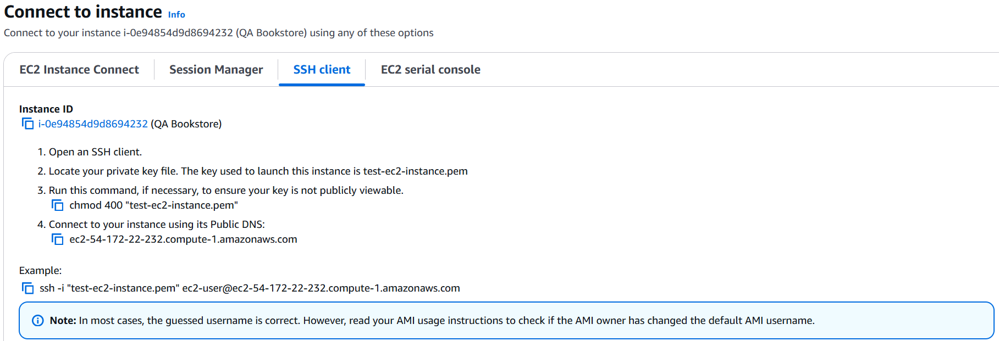
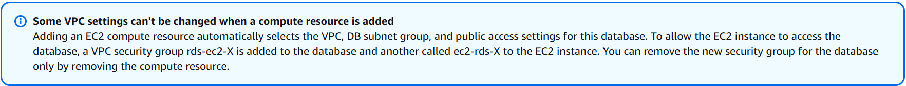
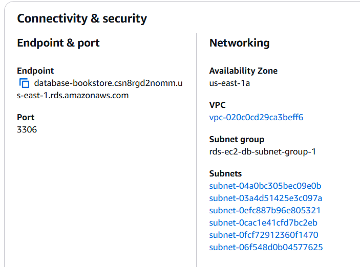
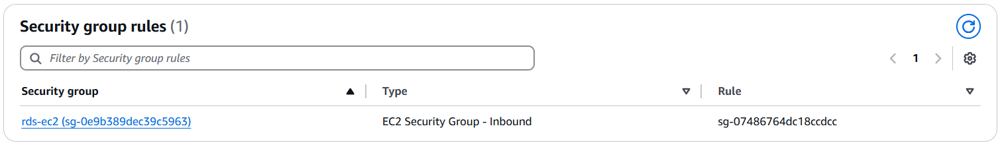
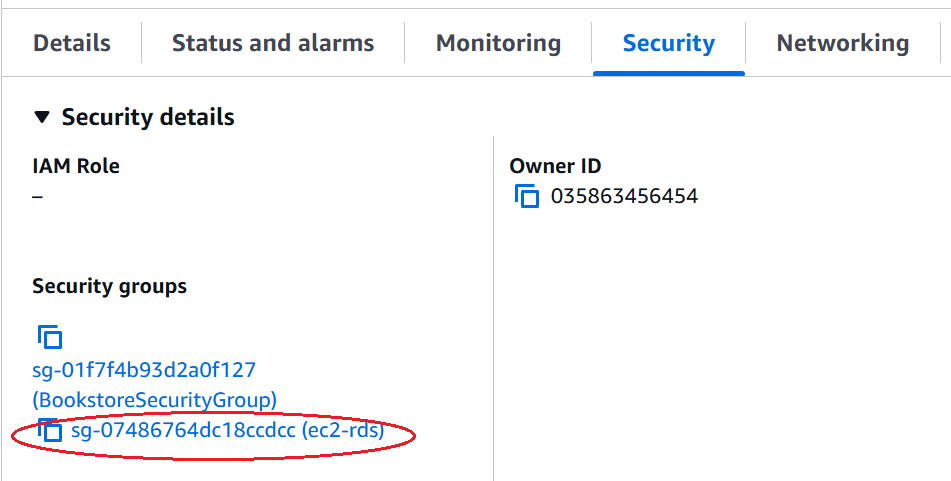
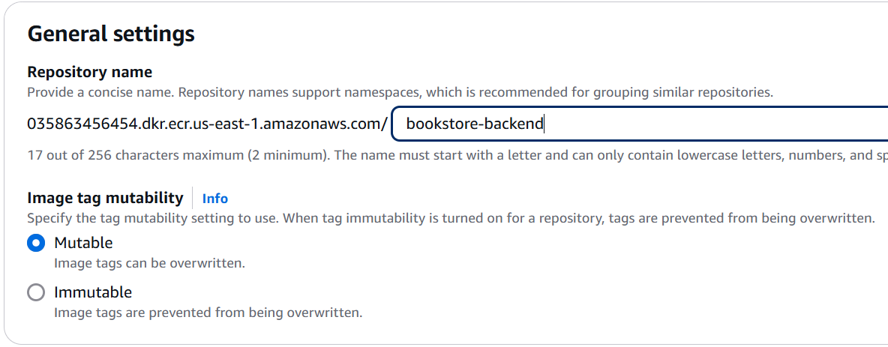
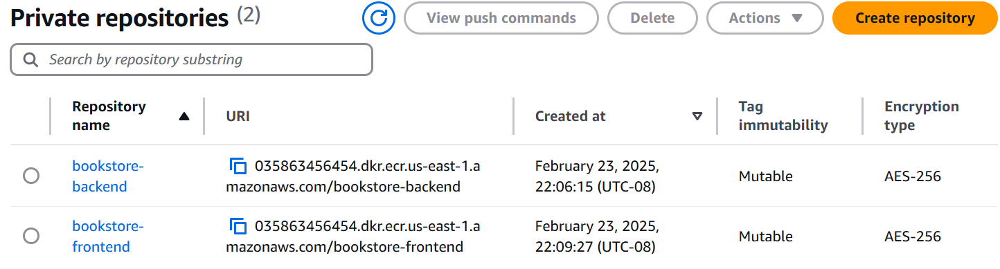
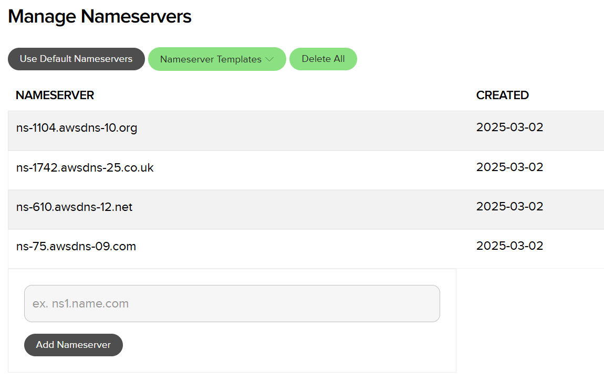
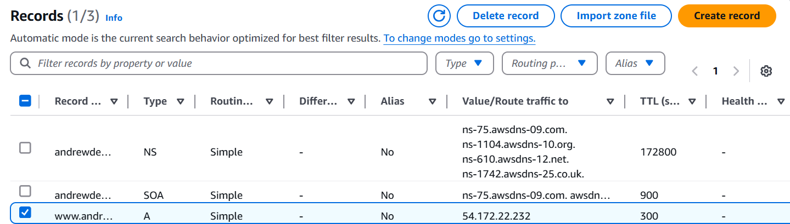
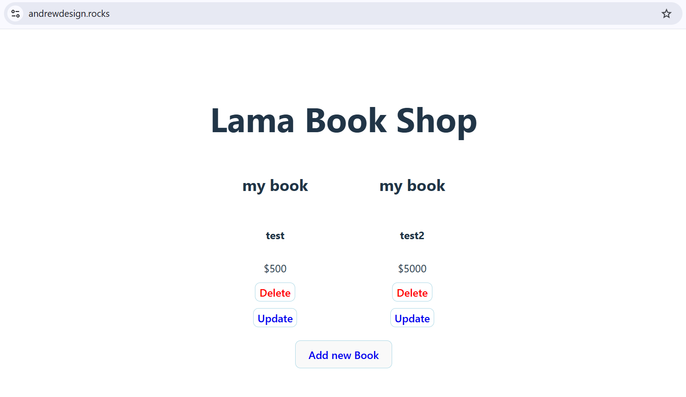

# bookstore-infra
Infrastructure repo for bookstore

## Objective
The goal is to create a simple CI/CD workflow that does
1. Nightly build that pushes Docker images to ECR
2. When there is a new image on ECR, we want to deploy the app to EC2

We will be using Github Actions and AWS (EC2, RDS, ECR, Route 53). 
We will be using 2 repositories, one for the source code and one for the infrastructure code.
The app itself is a web application, consisting of a frontend and backend:
- Frontend uses Vite
- Backend uses Express

The code for the source repo can be found here: https://github.com/aawihardja-usfca/bookstore.git

The infrastructure repo has the workflow related files https://github.com/aawihardja-usfca/bookstore-infra.git

## Steps
To follow along, you can start by forking both repositories. Here are the steps:

### 1. Get an AWS account
With an Access Key ID & Secret Access Key. If you are using AWS Academy Lab, you will also need the Session Token.<br>
Add them as Github Secrets to your bookstore-infra repo. You can do this by going to Github, find Settings, scroll down to Security part → Secrets and variables → Actions.
Add repository secrets for each of the 3 credentials, they need to be named **AWS_ACCESS_KEY_ID**, **AWS_SECRET_ACCESS_KEY**, **AWS_SESSION_TOKEN**, respectively.

---

### 2. Create security group
On AWS Console, create a Security Group. You can do this by typing EC2 on the search bar → scroll down on the sidebar until you find Network & Security → Security Groups. Click on it, then click <button>Create Security Group</button>. Name it however you want, you can pick an easily recognizable name like **BookstoreSecurityGroup**. For the VPC, pick the default VPC. You are going to add 3 inbound rules:

1. Type: *HTTPS*, Source: Anywhere IPv4. This will automatically set the protocol as *TCP*, Port range as *443* and the IP as *0.0.0.0/0*
    
2. Type: *HTTP*, Source: Anywhere IPv4. This will automatically set the protocol as *TCP*, Port range as *80* and the IP as *0.0.0.0/0*

3. Type: *SSH*, Source: Your IP. This will automatically set the protocol as *TCP*, Port range as *22* and the IP as your public IP.

The first two inbound rules allow https requests from anywhere on the internet to the resource, we need this so that we can access our application that lives on the EC2 from the browser. The third rule allows us to access the EC2 machine from the terminal, to install softwares and updates. If you set it to *0.0.0.0/0*, it allows all SSH requests from anywhere. It is recommended that you set it using your IP, so that it is not open to the public.

Leave the outbound rules as is.

As a note, we haven’t attached this Security Group to any resource. We will attach it to an EC2 instance in the upcoming steps. At this point, you should have something that looks like this (note the security group ID, we will use it later):


---

### 3. Create EC2 instance
Under EC2, find Instance on the sidebar. Click on <button>Launch Instance</button>. Name your instance “QA Bookstore”. Use Amazon Linux as the AMI. Use t2-micro as the Instance Type. For the Key-Pair login, you are going to create a new key-pair: you can name it test-ec2-instance, pick ED25519 as the type, and .pem file as the file format. Click “Create key pair”. This will download a .pem file into your local computer, you will need to provide this file when ssh-ing into the EC2 machine, so be sure to save it. Under Network settings → security groups, pick the “Select existing security group” option. On the dropdown that shows up, select the security group that you created on step 2 (**BookstoreSecurityGroup**). Leave everything else as is, then click <button>Launch instance</button>.
You should get something that looks like the following


---

### 4. Test SSH to EC2
At this point, you should be able to connect to your EC2 instance. Click on the <button>Connect</button> → SSH Client. This should provide you steps on how to connect. For instance, in my case, I can connect by executing the ssh command: ```ssh -i "test-ec2-instance.pem" ec2-user@ec2-54-172-22-232.compute-1.amazonaws.com``` from my terminal.



---

### 5. Create Github secrets for the .pem file
You want to copy the contents of the .pem file to a Github secret (similar to step 1). Name this variable **SSH_PRIVATE_KEY**. We will need this for our Github workflows to be able to ssh into the EC2.

---

### 6. Create RDS
Now we are going to create the database for our application. Go to RDS on AWS Console. Create the database using the standard create option. Pick MySQL for the engine option. Pick the free tier template. Set the DB identifier to database-bookstore. Leave the master username as admin, and set a password (self-managed). Under connectivity, select the connect to an EC2 compute resource option. This will show a dropdown for the instance to pick. Select the EC2 you set up on step 3 (QA Bookstore). It will show a message that says:


Leave the subnet group to use automatic setup. Most importantly, choose no to public access. Selecting this means that you can only connect to the database from the EC2. Leave everything else as is. Create the database. You should get something like (note the endpoint, we will need it later):


With the following security group rules:


This allows requests from a resource with the security group id of sg-07486764dc18ccdcc.
If you check your QA Bookstore EC2, it should have a new security group added. In my case, it is sg-07486764dc18ccdcc (ec2-rds). 
See this image (note the security group id for ec2-rds, we will need it later):



After you complete this step, go to your infra repo on Github and add a few more secret variables. Create 2 additional secrets: **RDS_PASSWORD** and **RDS_USER**. RDS user should be admin and password is the password that you set.

---

### 7. Set up the EC2 environment
Now we are ready to set up the QA Bookstore EC2 environment. We need to set up the database and Docker. You need to ssh into your EC2 by following the process in step 4. Once you are in the SSH terminal, execute the following commands:
```bash
sudo dnf update -y
sudo dnf install -y docker
sudo service docker start
sudo usermod -aG docker ec2-user
```
This will install and start Docker. Try running: ```docker --version```, you should get ```Docker version 25.0.8, build 0bab007```

Next, install docker compose plugin. To download and install the Docker Compose CLI plugin, run:
```
DOCKER_CONFIG=${DOCKER_CONFIG:-$HOME/.docker}
mkdir -p $DOCKER_CONFIG/cli-plugins
curl -SL https://github.com/docker/compose/releases/download/v2.33.1/docker-compose-linux-x86_64 -o $DOCKER_CONFIG/cli-plugins/docker-compose
chmod +x $DOCKER_CONFIG/cli-plugins/docker-compose
```
Test the installation using: ```docker compose version```. Expected output ```Docker Compose version v2.33.1```

To set up the database, we need to install the MySQL CLI client:
```
sudo dnf install mariadb105
```
Connect from EC2 to the RDS you created on step 6: ```mysql -h endpoint -P 3306 -u admin -p```
Where endpoint can be found on step 6, and admin is the default (master) username. You will be prompted for your password. 
You can now use SQL commands to create and update database.

Create a database named qa_db, then create a books table: 
```mysql
CREATE DATABASE qa_db;
USE qa_db;
CREATE TABLE IF NOT EXISTS books (id INT AUTO_INCREMENT PRIMARY KEY, title VARCHAR(100) NOT NULL, description TEXT NOT NULL, cover TEXT NULL, price INT NOT NULL);
```

---

### 8. Create ECR repository
From AWS Console, go to Elastic Container Registry (ECR). Create 2 private repositories, name them bookstore-backend and bookstore-frontend. Select mutable image tag. Leave everything else as is.



You will have 2 repositories, like so:



---

### 9. Setting up domain and Route 53 nameservers.
Go to Name.com and purchase a domain. Once you have your domain, login to AWS console and navigate to **Route 53**. Create a new hosted zone for your domain. It will provide you with a set of nameservers (e.g. ns-75.awsdns-09.com, ns-1104.awsdns-10.org, etc). 
You are going to update the nameservers of your domain in Name.com to use the ones provided by AWS. Login to Name.com → My Domains → click on your domain. Go to the Domain Details section, and click Manage Nameservers. Remove the nameservers provided by Name.com (e.g. ns1.name.com) and add the ones provided by Route 53. You should get something like this:



It might take a while for these changes to take effect.

---

### 10. Obtain an SSL certificate
We need to obtain a certificate to enable HTTPS requests. You can start by ssh-ing into QA Bookstore EC2, then executing:
```
sudo dnf -y install certbot
sudo certbot certonly --standalone -d www.<your-domain>
```
This will store your certificates under: ```/etc/letsencrypt/live/www.<your-domain>/```

---

### 11. Modify nginx config file
Go to your infra-repo on Github, locate nginx.qa.conf file. Change the server name to use your domain, like so:
```nginx
events { }

http {
  server {
    listen 443 ssl;
    server_name www.<your-domain>;

    ssl_certificate /etc/letsencrypt/live/www.<your-domain>/fullchain.pem;
    ssl_certificate_key /etc/letsencrypt/live/www.<your-domain>/privkey.pem;
    ssl_protocols TLSv1.2 TLSv1.3;
    ssl_ciphers HIGH:!aNULL:!MD5;

    # Route API calls to the backend
    location /api/ {
      proxy_pass http://backend:8800/;
      proxy_set_header Host $host;
      proxy_set_header X-Real-IP $remote_addr;
    }

    # Route all other traffic to the frontend
    location / {
      proxy_pass http://frontend:5173;
      proxy_set_header Host $host;
      proxy_set_header X-Real-IP $remote_addr;
    }
  }

  server {
    listen 80;
    server_name www.<your-domain>;
    return 301 https://$host$request_uri;
  }
}

```

---

### 12. Creating an A-record on Route 53
Login to AWS console, go to Route 53 and locate the hosted zone for your domain. Select create records. Set the record name to www and the record type as A. Set the value to be the public IPv4 address of your QA Bookstore EC2.



---

### 13. Modify Github workflow files
As the last step, locate the nightly build workflow under your infra-repo. Update the env variables **AWS_REGION**, **AWS_ID**, and **RDS_HOST**. Change the AWS id to your AWS account id. Change the RDS host to your database endpoint (step 6). Lastly, make the same changes to the deploy qa workflow.

## Running the workflow
You can run the workflow by triggering them manually. Start by running the nightly build, this will push 2 Docker images to ECR (1 for each frontend and backend). Once you have the images on ECR, you can run the deploy qa workflow. This will deploy your app and run it in the QA Bookstore EC2. If everything goes well, you can visit your domain using the browser and your app should be running.


