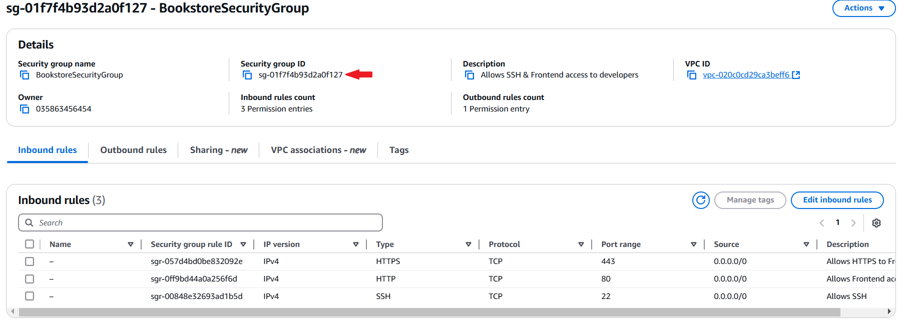
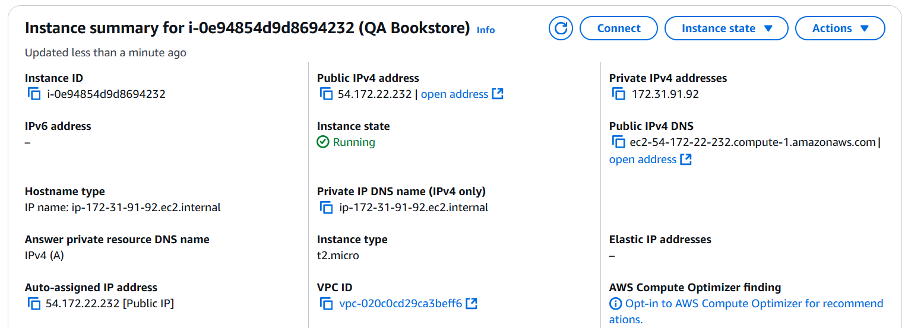

# bookstore-infra
Infrastructure repo for bookstore

## Objective
The goal is to create a simple CI/CD workflow that does
1. Nightly build that pushes Docker images to ECR
2. When there is a new image on ECR, we want to deploy the app to EC2

We will be using Github Actions and AWS (EC2, RDS, ECR, Route 53). 
We will be using 2 repositories, one for the source code and one for the infrastructure code.
The app itself is a web application, consisting of a frontend and backend:
- Frontend uses Vite
- Backend uses Express

The code for the source repo can be found here: https://github.com/aawihardja-usfca/bookstore.git

The infrastructure repo has the workflow related files https://github.com/aawihardja-usfca/bookstore-infra.git

## Steps
To follow along, you can start by forking both repositories. Here are the steps:

1. Get an AWS account, with an Access Key ID & Secret Access Key. If you are using AWS Academy Lab, you will also need the Session Token. 
Add them as Github Secrets to your bookstore-infra repo. You can do this by going to Github, find Settings, scroll down to Security part → Secrets and variables → Actions.  
Add repository secrets for each of the 3 credentials, they need to be named **AWS_ACCESS_KEY_ID**, **AWS_SECRET_ACCESS_KEY**, **AWS_SESSION_TOKEN**, respectively.

2. On AWS Console, create a Security Group. You can do this by typing EC2 on the search bar → scroll down on the sidebar until you find Network & Security → Security Groups.  
Click on it, then click <button>Create Security Group</button>. Name it however you want, you can pick an easily recognizable name like **BookstoreSecurityGroup**. For the VPC, pick the default VPC. You are going to add 3 inbound rules:

    1. Type: *HTTPS*, Source: Anywhere IPv4. This will automatically set the protocol as *TCP*, Port range as *443* and the IP as *0.0.0.0/0*
    
    2. Type: *HTTP*, Source: Anywhere IPv4. This will automatically set the protocol as *TCP*, Port range as *80* and the IP as *0.0.0.0/0*

    3. Type: *SSH*, Source: Your IP. This will automatically set the protocol as *TCP*, Port range as *22* and the IP as your public IP.

    The first two inbound rules allow https requests from anywhere on the internet to the resource, we need this so that we can access our application that lives on the EC2 from the browser. 
    
    The third rule allows us to access the EC2 machine from the terminal, to install softwares and updates. If you set it to *0.0.0.0/0*, it allows all SSH requests from anywhere. It is recommended that you set it using your IP, so that it is not open to the public.

	Leave the outbound rules as is.

    As a note, we haven’t attached this Security Group to any resource. We will attach it to an EC2 instance in the upcoming steps. At this point, you should have something that looks like this (note the security group ID, we will use it later):

    

3. Under EC2, find Instance on the sidebar. Click on <button>Launch Instance</button>. Name your instance “QA Bookstore”. Use Amazon Linux as the AMI. Use t2-micro as the Instance Type. For the Key-Pair login, you are going to create a new key-pair: you can name it test-ec2-instance, pick ED25519 as the type, and .pem file as the file format. Click “Create key pair”. This will download a .pem file into your local computer, you will need to provide this file when ssh-ing into the EC2 machine, so be sure to save it.
Under Network settings → security groups, pick the “Select existing security group” option. On the dropdown that shows up, select the security group that you created on step 2 (**BookstoreSecurityGroup**). Leave everything else as is, then click <button>Launch instance</button>.
You should get something that looks like the following

